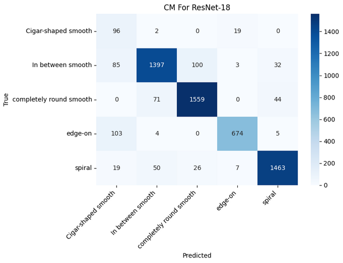
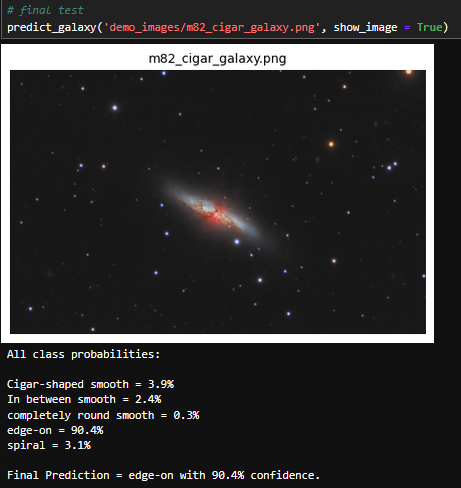
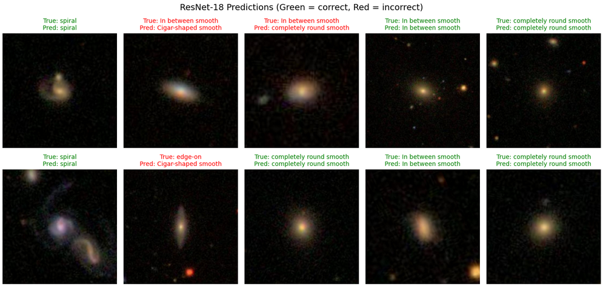

# Galaxy Morphology Classification

This is an image classifier that uses the ResNet-18 model to identify the morphological class of a galaxy.

## Hardware and Support

- The notebook was configured for NVIDIA GPU machines that run CUDA.
- **AMD/Mac Users:** The notebook will default to CPU, but for GPU utilisation, check the links below for command line installation prompts:

- [ROCm (AMD)](https://pytorch.org/get-started/locally/)
- [MPS (Mac)](https://developer.apple.com/metal/pytorch/)

## Evaluation & Results

The model managed to achieve a test accuracy score of **90.1%** after 10 epochs of training. Below is the confusion matrix which shows the performance across each galaxy class. 

**Model Inference:**

Below is an example prediction of M82, otherwise known as the cigar galaxy, with confidence levels.

**Batch Visualisation:**

A random sample of images plotted with their corresponding true and predicted labels.

## How to run

1. Install dependencies with: `pip install -r requirements.txt`
2. Download the images dataset from [Galaxy Zoo classification](https://www.kaggle.com/datasets/anjosut/galaxy-zoo-the-galaxy-challenge) and place them in the `Train_images` folder.
3. Open `classifier.ipynb` and run the notebook.